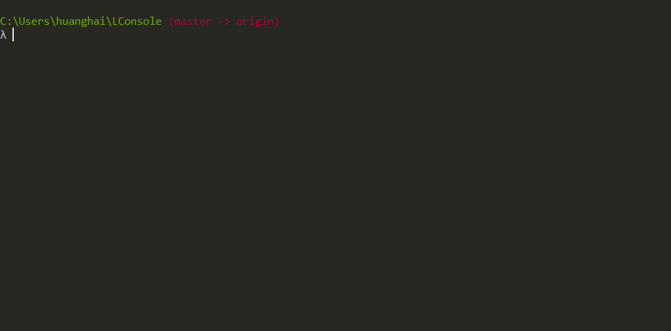

# Liner based console program for syntax highlight in realtime

Chinese version: [中文](README_cn.md)

## Summary

LConsole is a [liner](https://github.com/peterh/liner) based console program for syntax highlight.

## Overview

LConsole is base on my [monkey](https://github.com/haifenghuang/monkey) language.
I think that maybe useful to others, so i created this repository. At the meantime,
it used as a reference for myself.

The highlight code in `highlighter.go` is not very suited for other programming language,
but should not be so difficult to do it.

## Demo

Below is the demo program showing what it is:

## Installation

Just download the repository and run `./run.sh`

## Limitation

There are some limitations you need to konw:

* The `multiLineMode` of `liner` is not supported.
* The code is not tested thoroughly.
* I only tested the code in centos and windows.

## License

MIT
