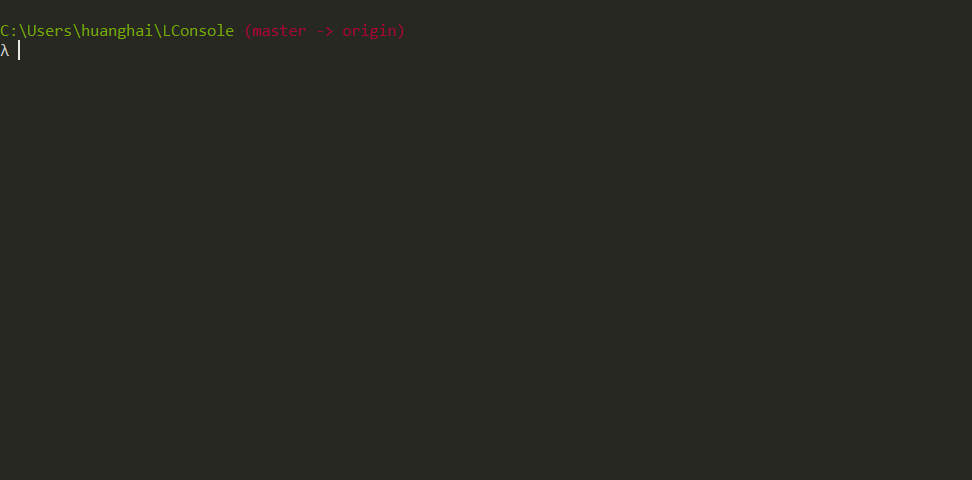

# 基于Liner的实时语法高亮Console程序

英文版: [English](README.md)

## 概述

LConsole是基于[liner](https://github.com/peterh/liner)的一个实时语法高亮程序.

## 总览

LConsole是基于我的另外一个项目[monkey](https://github.com/haifenghuang/monkey).
其中部分代码可能对大家有用，所以创建了这个仓库。同时也作为自己参考用。

`highlighter.go`文件中的高亮代码并不完全适合其它项目语言。
但更改成其它的语言，难度应该不会太大。

## 示例

下面展示了这个程序的运行效果:

## 安装

下载此项目，然后运行`./run.sh`

## 局限

下面的部分局限你需要知道:

* `liner`的`multiLineMode`现在还不支持
* 代码没有完全测试过
* 仅仅在centos和windows下测试通过

## 许可证

MIT
